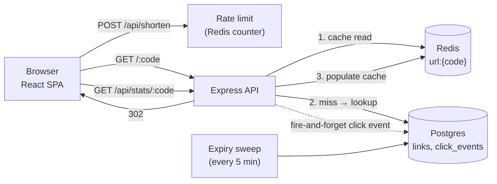

# snip — a URL shortener built as a system design study

A working URL shortener with the features interviewers actually ask about: short-code
generation, a cache-aside read path, custom aliases, link expiry, async click analytics,
and rate limiting — plus a UI and a document explaining every tradeoff.

**Stack:** Express (TypeScript) · PostgreSQL · Redis · React (Vite, TypeScript)

---

## Quickstart

Requirements: Node 20+, Docker.

```bash
docker compose up -d      # postgres + redis
npm install               # installs both workspaces
npm run dev               # api on :3000, web on :5173
```

Open **http://localhost:5173**. Short URLs resolve at `http://localhost:3000/:code`.

```bash
npm test        # server unit tests (base62, validation)
npm run typecheck
```

---

## API

| Method | Path                  | Body / Params                                    | Success | Errors |
| ------ | --------------------- | ------------------------------------------------ | ------- | ------ |
| POST   | `/api/shorten`        | `{url, customAlias?, expiresInSeconds?}`         | `201`   | `400` invalid input, `409` alias taken, `429` rate limited |
| GET    | `/:code`              | —                                                | `302` redirect | `404` unknown, `410` expired |
| GET    | `/api/stats/:code`    | —                                                | `200`   | `404` |
| GET    | `/api/health`         | —                                                | `200`   | `503` |

Rate limiting applies only to `POST /api/shorten` — **30 requests / 60s / IP**,
enforced by a Redis fixed-window counter. Responses carry `X-RateLimit-*` headers;
`429`s carry `Retry-After`.

---

## Architecture



### The read path (cache-aside)

1. `GET /:code` checks Redis first (`url:{code}`). Most traffic ends here.
2. On a miss, Postgres is queried and the entry is written back to Redis.
3. Redirects are `302`, not `301` — browsers re-check on every click, so
   analytics stay accurate and changes to a link propagate instantly.

Cache TTL is the link's **remaining lifetime** (capped at 24h), so an expired
link can never be served from cache. Cache reads fail open: if Redis is down,
traffic falls through to Postgres.

### The write path (analytics)

Clicks are recorded **fire-and-forget** after the redirect decision — an insert
into `click_events` plus an increment of a denormalized `links.click_count`.
The redirect never waits on analytics and never fails because of it.

At scale this write path would graduate to: Redis-buffered batches → Kafka →
a rollup table. The demo keeps it simple and points at the escape hatch.

### Expiry

Two mechanisms, both cheap:

- **Lazy delete** — an expired link found during a redirect is deleted
  immediately (events cascade) and returns `410`.
- **Periodic sweep** — every 5 minutes a job removes expired rows so lookups
  and stats stay clean even for links nobody visits.

---

## Design decisions

### 1. Short-code generation

**Choice: random 7-char base62 with collision retry.**

62^7 ≈ 3.5 trillion codes. Random codes are generated with
`crypto.randomBytes` (rejection-sampled to avoid modulo bias) and inserted
under a unique constraint — a collision simply retries (at most 3 attempts).

| Alternative | Pros | Cons |
| --- | --- | --- |
| **Counter + base62** (`encode(id)`) | zero collisions, trivially correct | sequential codes expose volume and are guessable |
| **Pregenerated key pool** (KGS) | no retry loop at write time | extra infra; keys can leak/queue backpressure |

Random generation keeps the API stateless and needs no coordination between
instances. The unique index is the single source of truth.

### 2. Why 302 over 301

`301` is cached permanently by browsers — subsequent clicks never reach the
server, killing analytics and making a URL un-changeable. `302` keeps every
click observable at the cost of one extra round trip.

### 3. Rate limiting — fixed window

`INCR rl:{ip}:{windowIndex}` + `EXPIRE` = two O(1) Redis ops per request.

| Alternative | Property |
| --- | --- |
| Fixed window (chosen) | simplest; boundary burst of up to 2× the limit |
| Sliding window log | exact; O(n) memory per IP |
| Token bucket | smooth; allows controlled bursts |

The limiter **fails open** — if Redis is unavailable, requests proceed.
For an abuse-sensitive product that choice might flip to fail-closed.

### 4. Data model

```sql
links (id, code UNIQUE, original_url, is_custom,
       expires_at, click_count, created_at)
click_events (id, code → links.code ON DELETE CASCADE,
              referrer, user_agent, clicked_at)
```

`click_count` is denormalized so the total is one row read, not a count over
events. Indices: `(expires_at)` partial, `(code, clicked_at DESC)` for the
per-day and referrer aggregations.

### 5. Reclaiming memory from unknown codes

An attacker hammering random codes misses cache and Postgres every time
(cache penetration). The standard answer is a **bloom filter** of live codes
in front of the cache — not needed at demo scale, but it is the natural
next hardening step.

---

## Capacity estimation (back-of-envelope)

Assumptions: 100M new links/month, 100:1 read:write (typical for shorteners).

- Writes: 100M / 31d / 86.4k s ≈ **40 writes/s** (avg), ~5× peak ≈ 200/s
- Reads: 100 × writes ≈ **4,000 reads/s** avg, ~20k/s peak
- Storage: 100M × ~500 B/link incl. events ≈ **50 GB/mo** → shard long before
  a single Postgres box hurts
- Cache: hot links follow a power law; a 10M-entry Redis (~1 GB) can serve
  the overwhelming majority of reads

The read-heavy ratio is why the design invests in the cache path and keeps
writes minimal (one insert, no synchronous analytics).

---

## Scaling path

1. **Stateless API** — Express holds no session state; scale horizontally
   behind a load balancer.
2. **Read replicas** — redirects are reads; replicate Postgres and let the
   cache absorb misses.
3. **Shard by code** — hash the short code to a shard; a redirect touches
   exactly one shard. No cross-shard joins exist in the hot path.
4. **Swap Postgres for a KV store** (DynamoDB/RocksDB) once link rows stop
   needing relational features; the schema is already key-shaped.
5. **Analytics pipeline** — move `recordClickAsync` to Kafka + worker +
   rollup tables; stats queries then never touch the serving database.
6. **CDN** for the SPA; the API itself stays dynamic for 302s.

---

## Deploy

The repo ships a production stack: `compose.prod.yml` builds two images
(server → Node, client → nginx serving the SPA and proxying `/api` and
short codes to the API) plus Postgres and Redis with health-gated startup.
Migrations run automatically when the API boots.

**Local rehearsal** (same images a VPS would run):

```powershell
powershell -File scripts\deploy.ps1        # builds, starts on http://localhost:8080
powershell -File scripts\deploy.ps1 -Down  # stops it
```

**On a VPS** (Hetzner / DigitalOcean / EC2 — any host with Docker):

```bash
# once: provision a VM, install Docker, add your SSH key
git clone <your-repo> && cd url-shortner
BASE_URL=https://snip.example.com ./scripts/deploy.sh
```

Then:

1. **DNS** — point an `A`/`AAAA` record at the VM's IP.
2. **TLS** — either run Caddy/nginx on ports 80/443 in front (change
   `WEB_PORT` to bind only to the host, or drop `ports` entirely and let
   the edge proxy reach the container via the docker network), or put a
   cloud load balancer in front and terminate TLS there.
3. **`BASE_URL` must be the public https origin** — it is what the API
   stamps into every short URL it returns.
4. **Secrets** — before real traffic, replace the demo `shortener`
   Postgres credentials with real ones (env or Docker secrets), and set
   `RATE_LIMIT_MAX` to taste.

**Managed platforms** (Railway, Fly.io, Render): deploy `server/Dockerfile`
as the web service, attach managed Postgres + Redis, and set the same env
vars the compose file sets. Serve the client from any static host and
proxy `/api` + short codes to the service, or put nginx in front as
`compose.prod.yml` does.

---

## Project layout

```
url-shortner/
├─ server/              # Express + TypeScript API
│  ├─ migrations/       # SQL migrations (applied at boot)
│  ├─ Dockerfile        # multi-stage: build → slim production image
│  └─ src/
│     ├─ lib/           # base62, validation, cache, rate limit, analytics
│     ├─ routes/        # shorten, redirect (hot path), stats
│     ├─ db/            # pg pool, migration runner, link queries
│     └─ redis/         # ioredis client
├─ client/              # Vite + React SPA (Geist, dark minimal UI)
│  ├─ Dockerfile        # build → nginx (SPA + reverse proxy)
│  ├─ nginx.conf        # serves the SPA, proxies /api and /:code
│  └─ src/components/   # form, result, recents (localStorage), stats chart
├─ scripts/             # deploy.ps1 / deploy.sh — run compose.prod.yml
├─ compose.prod.yml     # postgres + redis + api + nginx, health-gated
└─ docker-compose.yml   # dev infra only (postgres + redis)
```

Recent links live in `localStorage` — the demo has no user accounts by design.

---

## Verification

- `npm run typecheck` + `npm test` pass for both workspaces
- End-to-end script exercised: shorten → redirect ×2 (cache hit) → stats
  (3 clicks recorded) → custom alias (201) → duplicate alias (409) →
  alias redirect → 2s-expiry link (302 → `410` after deadline, row swept) →
  invalid URL (400) → unknown code (404) → 40 rapid requests (rate limiter
  trips with `429`)

Every number in this README is either a default in `server/src/config.ts`
or derived in `server/src` — the code is the source of truth.
