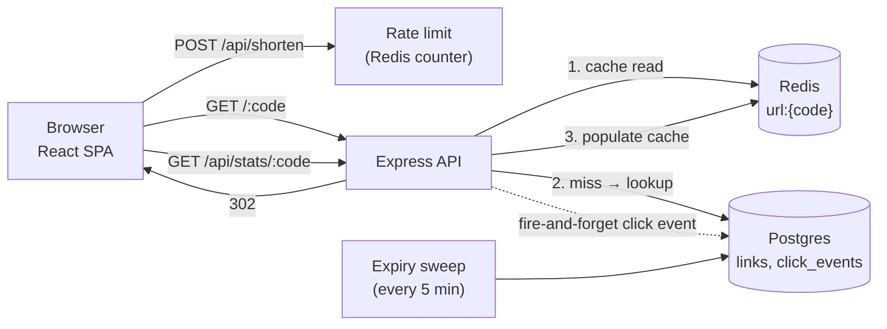

# snip — a URL shortener built as a system design study

A working URL shortener with the features interviewers actually ask about: short-code
generation, a cache-aside read path, custom aliases, link expiry, async click analytics,
and rate limiting — plus a UI and a document explaining every tradeoff.

**Stack:** Express (TypeScript) · PostgreSQL · Redis · React (Vite, TypeScript)

[](https://github.com/goesbyabhi/url-shortner/actions/workflows/ci.yml)

---

## Quickstart

Requirements: Node 20+, Docker.

```bash
docker compose up -d      # postgres + redis
npm install               # installs both workspaces
npm run dev               # api on :3000, web on :5173
```

Open **http://localhost:5173**. Short URLs resolve at `http://localhost:3000/:code`.

```bash
npm test                  # server unit tests (base62, validation)
npm run typecheck         # both workspaces
bash scripts/e2e.sh       # end-to-end suite against a running api (needs curl + jq)
```

CI (`.github/workflows/ci.yml`) runs three jobs on every push/PR:
**unit tests + typecheck + client build**, an **end-to-end job** that boots
the API against real Postgres/Redis service containers and asserts the
full lifecycle (shorten → 302s → stats → 409 → 410 → 400 → 404 → 429),
and a **docker job** that proves both production images build.

---

## API

| Method | Path                  | Auth | Body / Params                            | Success | Errors |
| ------ | --------------------- | ---- | ---------------------------------------- | ------- | ------ |
| POST   | `/api/keys`           | —    | —                                        | `201`   | `429` rate limited |
| POST   | `/api/shorten`        | key  | `{url, customAlias?, expiresInSeconds?}` | `201`   | `400` invalid input, `401`, `409` alias taken, `429` rate limited |
| GET    | `/:code`              | —    | —                                        | `302` redirect | `404` unknown, `410` expired |
| GET    | `/api/stats/:code`    | key  | —                                        | `200`   | `401`, `404` |
| GET    | `/api/links`          | key  | `?limit=20&cursor=`                      | `200`   | `400` bad cursor, `401` |
| DELETE | `/api/links/:code`    | key  | —                                        | `204`   | `401`, `404` |
| GET    | `/api/health`         | —    | —                                        | `200`   | `503` |

`key` means `Authorization: Bearer <token>`. Get a token from `POST /api/keys`; the
token is returned once and only its SHA-256 hash is stored. Redirects and health are
public — a short link is shareable by design — but everything that touches *your*
links requires your key. See design decision #7.

Rate limiting applies only to `POST /api/shorten` — **30 requests / 60s / IP**,
enforced by a Redis fixed-window counter. Responses carry `X-RateLimit-*` headers;
`429`s carry `Retry-After`.

---

## Architecture



### The read path (cache-aside)

1. `GET /:code` checks Redis first (`url:{code}`). Most traffic ends here.
2. On a miss, Postgres is queried and the entry is written back to Redis.
3. Redirects are `302`, not `301` — browsers re-check on every click, so
   analytics stay accurate and changes to a link propagate instantly.

Cache TTL is the link's **remaining lifetime** (capped at 24h), so an expired
link can never be served from cache. Cache reads fail open: if Redis is down,
traffic falls through to Postgres.

### The write path (analytics)

Clicks are recorded **fire-and-forget** after the redirect decision — an insert
into `click_events` plus an increment of a denormalized `links.click_count`.
The redirect never waits on analytics and never fails because of it.

At scale this write path would graduate to: Redis-buffered batches → Kafka →
a rollup table. The demo keeps it simple and points at the escape hatch.

### Expiry

Two mechanisms, both cheap:

- **Lazy delete** — an expired link found during a redirect is deleted
  immediately (events cascade) and returns `410`.
- **Periodic sweep** — every 5 minutes a job removes expired rows so lookups
  and stats stay clean even for links nobody visits.

---

## Design decisions

### 1. Short-code generation

**Choice: random 7-char base62 with collision retry.**

62^7 ≈ 3.5 trillion codes. Random codes are generated with
`crypto.randomBytes` (rejection-sampled to avoid modulo bias) and inserted
under a unique constraint — a collision simply retries (at most 3 attempts).

| Alternative | Pros | Cons |
| --- | --- | --- |
| **Counter + base62** (`encode(id)`) | zero collisions, trivially correct | sequential codes expose volume and are guessable |
| **Pregenerated key pool** (KGS) | no retry loop at write time | extra infra; keys can leak/queue backpressure |

Random generation keeps the API stateless and needs no coordination between
instances. The unique index is the single source of truth.

### 2. Why 302 over 301

`301` is cached permanently by browsers — subsequent clicks never reach the
server, killing analytics and making a URL un-changeable. `302` keeps every
click observable at the cost of one extra round trip.

### 3. Rate limiting — fixed window

`INCR rl:{ip}:{windowIndex}` + `EXPIRE` = two O(1) Redis ops per request.

| Alternative | Property |
| --- | --- |
| Fixed window (chosen) | simplest; boundary burst of up to 2× the limit |
| Sliding window log | exact; O(n) memory per IP |
| Token bucket | smooth; allows controlled bursts |

The limiter **fails open** — if Redis is unavailable, requests proceed.
For an abuse-sensitive product that choice might flip to fail-closed.

### 4. Data model

```sql
links (id, code UNIQUE, original_url, is_custom,
       expires_at, click_count, created_at)
click_events (id, code → links.code ON DELETE CASCADE,
              referrer, user_agent, clicked_at)
```

`click_count` is denormalized so the total is one row read, not a count over
events. Indices: `(expires_at)` partial, `(code, clicked_at DESC)` for the
per-day and referrer aggregations.

### 5. Reclaiming memory from unknown codes

### 6. Listing links — and the one design smell

`GET /api/links` returns every link, newest first. Two decisions worth defending:

- **Keyset (cursor) pagination over the `bigserial id`, not `OFFSET`.** The cursor is the
  last seen id (`WHERE id < $cursor ORDER BY id DESC LIMIT n+1`). New links can be inserted
  between pages without shifting rows into or out of the next page, and page cost stays flat
  instead of scanning-and-discarding `OFFSET` rows.
- **Fetch `limit + 1` rows** to detect whether another page exists without a second query,
  and **count the total only on the first page** — an unconditional `COUNT(*)` per page is an
  O(n) scan on every request, trivial to abuse.

**Scope it to the caller.** An unauthenticated listing lets anyone enumerate every link ever
created. The fix — decision #7 — is an owner id on the `WHERE` clause; nothing else about the
pagination design changes when you add it.

Related smaller tradeoffs:

- **Delete (`DELETE /api/links/:code`) is owner-scoped too, and 404s rather than 403s.**
  Answering 403 for someone else's link would confirm the code exists; 404 keeps the endpoint
  useless as a probe. Cache invalidation on delete is not optional either, or the short code
  keeps redirecting until its TTL expires.
- **Shortening the same URL twice creates two links.** Deliberate: it keeps `POST /api/shorten`
  idempotent-free and stateless. A "return the existing code for an identical URL" lookup is
  the alternative, at the cost of a hot-row lookup per write.
- **Rate limiting covers writes only** (`POST /api/shorten` and `POST /api/keys`). Reads
  through a valid key — redirects, stats, the listing — are unmetered, the right default for a
  read-heavy shortener now that listings can't be enumerated anonymously. Redirects stay
  public: a short link is shareable.

### 7. Auth scoping — anonymous keys, hashed at rest

Listing, stats, and delete are owner-only. Instead of building accounts (email, passwords,
reset flows) for a demo, the app mints an **anonymous API key** on first use and keeps it in
the browser; every endpoint that touches *your* links requires it.

- **Only the hash is stored.** `api_keys.token_hash = sha256(token)`. The token is 256 bits
  from `crypto.randomBytes`, so one fast hash is the right tool — salts and slow KDFs exist to
  defend low-entropy human passwords, not random keys.
- **Keys are principals, not sessions.** No expiry or refresh machinery: revoking a key means
  deleting its row, and `ON DELETE CASCADE` takes that key's links with it.
- **404, never 403.** A link that exists but belongs to someone else is indistinguishable from
  one that doesn't, so the API cannot be used to probe which codes exist.
- **One indexed lookup per authenticated request.** Caching hash → owner (Redis) is the next
  optimization when the auth path gets hot, paid for with cache invalidation on revocation.
- **Legacy rows** created before auth have `owner_id IS NULL`: they still redirect, but no key
  owns them, so they never appear in a listing and cannot be deleted through the API.
- **The cost of no signup:** clearing site data loses the key — and with it, access to your
  links. They keep resolving; you just can't list or delete them. That is the honest price of
  skipping accounts, and why a real product would offer real logins or key export.

---

## Capacity estimation (back-of-envelope)

Assumptions: 100M new links/month, 100:1 read:write (typical for shorteners).

- Writes: 100M / 31d / 86.4k s ≈ **40 writes/s** (avg), ~5× peak ≈ 200/s
- Reads: 100 × writes ≈ **4,000 reads/s** avg, ~20k/s peak
- Storage: 100M × ~500 B/link incl. events ≈ **50 GB/mo** → shard long before
  a single Postgres box hurts
- Cache: hot links follow a power law; a 10M-entry Redis (~1 GB) can serve
  the overwhelming majority of reads

The read-heavy ratio is why the design invests in the cache path and keeps
writes minimal (one insert, no synchronous analytics).

---

## Scaling path

1. **Stateless API** — Express holds no session state; scale horizontally
   behind a load balancer.
2. **Read replicas** — redirects are reads; replicate Postgres and let the
   cache absorb misses.
3. **Shard by code** — hash the short code to a shard; a redirect touches
   exactly one shard. No cross-shard joins exist in the hot path.
4. **Swap Postgres for a KV store** (DynamoDB/RocksDB) once link rows stop
   needing relational features; the schema is already key-shaped.
5. **Analytics pipeline** — move `recordClickAsync` to Kafka + worker +
   rollup tables; stats queries then never touch the serving database.
6. **CDN** for the SPA; the API itself stays dynamic for 302s.

---

## Deploy

The repo ships a production stack: `compose.prod.yml` builds two images
(server → Node, client → nginx serving the SPA and proxying `/api` and
short codes to the API) plus Postgres and Redis with health-gated startup.
Migrations run automatically when the API boots.

**Local rehearsal** (same images a VPS would run):

```powershell
powershell -File scripts\deploy.ps1        # builds, starts on http://localhost:8080
powershell -File scripts\deploy.ps1 -Down  # stops it
```

**On a VPS** (Hetzner / DigitalOcean / EC2 — any host with Docker):

```bash
# once: provision a VM, install Docker, add your SSH key
git clone <your-repo> && cd url-shortner
BASE_URL=https://snip.example.com ./scripts/deploy.sh
```

Then:

1. **DNS** — point an `A`/`AAAA` record at the VM's IP.
2. **TLS** — either run Caddy/nginx on ports 80/443 in front (change
   `WEB_PORT` to bind only to the host, or drop `ports` entirely and let
   the edge proxy reach the container via the docker network), or put a
   cloud load balancer in front and terminate TLS there.
3. **`BASE_URL` must be the public https origin** — it is what the API
   stamps into every short URL it returns.
4. **Secrets** — before real traffic, replace the demo `shortener`
   Postgres credentials with real ones (env or Docker secrets), and set
   `RATE_LIMIT_MAX` to taste.

**Managed platforms** (Railway, Fly.io, Render): deploy `server/Dockerfile`
as the web service, attach managed Postgres + Redis, and set the same env
vars the compose file sets. Serve the client from any static host and
proxy `/api` + short codes to the service, or put nginx in front as
`compose.prod.yml` does.

### Free-tier cloud (no VPS)

Fully free, credit-card-less deployment: **Render** (API) + **Neon**
(Postgres) + **Upstash** (Redis) + **Cloudflare Pages** (SPA). The only
app changes needed are env vars — `PGSSL=true` for Neon's TLS,
`CORS_ORIGIN` set to your Pages domain, `VITE_API_URL` baked into the SPA
build, and `BASE_URL` as the public API origin (it stamps short URLs).

1. **Neon** — create a project, copy the connection params into the
   Render env vars (`PGSSL=true`).
2. **Upstash** — create a database, copy the `rediss://…` URL into
   `REDIS_URL`.
3. **Render** — New → Blueprint → pick this repo. `render.yaml` defines
   the service; set the `sync: false` values after the first deploy.
   Free services sleep after ~15 min idle — the first request pays a
   ~30-60s cold start. Short URLs resolve on the API origin
   (`https://snip-api.onrender.com/abc1234`).
4. **Cloudflare Pages** — build the SPA with the API origin baked in:

   ```bash
   VITE_API_URL=https://snip-api.onrender.com npm run build -w client
   npx wrangler pages deploy client/dist --project-name snip
   ```

   Then set Render's `CORS_ORIGIN` to the returned `*.pages.dev` origin.

**Why not all-Cloudflare?** Workers can't run this Express app as-is —
`pg` would need [Hyperdrive](https://developers.cloudflare.com/hyperdrive/)
and `ioredis` has no Workers-compatible transport (you'd use Workers KV
or Durable Objects for cache + rate limiting instead). That's a rewrite
of `server/src` to something like Hono — same design, different runtime —
and a fine stretch goal, but not a config change.

---

## Project layout

```
url-shortner/
├─ server/              # Express + TypeScript API
│  ├─ migrations/       # SQL migrations (applied at boot)
│  ├─ Dockerfile        # multi-stage: build → slim production image
│  └─ src/
│     ├─ lib/           # base62, validation, cache, rate limit, analytics
│     ├─ routes/        # shorten, redirect (hot path), stats
│     ├─ db/            # pg pool, migration runner, link queries
│     └─ redis/         # ioredis client
├─ client/              # Vite + React SPA (Geist, dark minimal UI)
│  ├─ Dockerfile        # build → nginx (SPA + reverse proxy)
│  ├─ nginx.conf        # serves the SPA, proxies /api and /:code
│  └─ src/components/   # form, result, links list (paginated), stats chart
├─ scripts/             # deploy.ps1 / deploy.sh, e2e.sh
├─ render.yaml           # free-tier cloud blueprint (Render)
├─ compose.prod.yml     # postgres + redis + api + nginx, health-gated
└─ docker-compose.yml   # dev infra only (postgres + redis)
```

The link list is **server-backed** (`GET /api/links`, newest first, keyset paginated), so
every shortened link is visible from any browser. There are no user accounts, which makes
that endpoint the one genuine design smell in the project — see design decision #6.

---

## Verification

- `npm run typecheck` passes for both workspaces; `npm test` covers the server libs
- The e2e suite (`scripts/e2e.sh` in CI, `scripts/e2e.ps1` on Windows) covers 31 checks:
  key issuance + 401s → shorten → redirect ×2 (cache hit) → stats (3 clicks recorded) →
  custom alias (201) → duplicate alias (409) → alias redirect → 2s-expiry link (302 → `410`
  after deadline, row swept) → invalid URL (400) → unknown code (404) → listing + keyset
  pagination (`total` only on the first page, no page overlap, invalid cursor 400) →
  **cross-key isolation** (a second key can't list, read stats for, or delete the link, and it
  still resolves) → owner delete (302 → `204` → `404`, gone from the listing, second delete
  404) → rate limiter (429)
- The production images build cleanly in CI, and the stack was verified
  end-to-end through nginx before the first release

Every number in this README is either a default in `server/src/config.ts`
or derived in `server/src` — the code is the source of truth.
